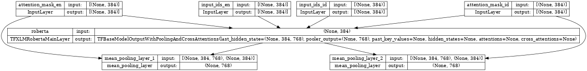

# Semantic Search for Discussion Forum and Modules Search

This repository contains all the scripts that we use to create a semantic search system for discussion forums and module search.

Semantic search systems are bi-encoder models that encode the query and the document separately into fixed-dimensional vectors. The query and document vectors are then compared using a desired similarity metric to determine the relevance of the document to the query. You can learn more about neural information retrieval [here](https://www.sbert.net/index.html) and find an example of semantic search [here](https://www.sbert.net/examples/applications/semantic-search/README.html).

Let me describe each of the folders and scripts in this repository:

1. `EDA-Dicoding-Document` contains two scripts that we use for exploratory data analysis (EDA) or to examine the documents used for our semantic search. The documents are from the [Dicoding](https://www.dicoding.com) course and are written in Indonesian language. The two scripts are:
   - `generate_content_modules.py` converts the provided JSON file into a bunch of text files containing the content of the modules/discussions. The output of this script is a folder that contains all the text files.
   - `generate_json.py` converts the text files (which only contain text in Markdown format without other attributes like pictures) back into a JSON file that contains the content of the modules/discussions.

2. `preprocessing-Dicoding-Document` contains five scripts that we use to preprocess the documents for our semantic search. We need to partition each module/discussion so that the text can be fed into the transformers model with a maximum of 256 tokens. The scripts are:
   - `generate_discussion_search.py` creates partitions of the discussions, making them suitable for feeding into the model. The output of this script is a JSON file that contains the partitioned discussions, with additional steps to make the content more search-friendly.
   - `generate_modules_search.py` is similar to `generate_discussion_search.py`, but for modules.
   - `doc2q.py` is a utility script/function that creates a question from a given paragraph or document. The purpose of this script is to generate a question from the content of the modules/discussions to make it more search-friendly. You can refer to this [paper](https://arxiv.org/abs/1904.08375) for justification of this approach.
   - `string_2_code.py` converts strings that are not in code block format to code block format.

3. `prepare-dataset` contains four scripts that we use to prepare the dataset for the training process. We follow the approach described in the paper [Making Monolingual Sentence Embeddings Multilingual using Knowledge Distillation](https://paperswithcode.com/paper/making-monolingual-sentence-embeddings). The scripts are:
   - `download_dataset_OPUS.py` downloads the dataset from the [OPUS](http://opus.nlpl.eu/) website. The dataset we use is the Indonesian-English parallel dataset. The output of this script is either a JSON or CSV file containing parallel sentences in Indonesian and English.
   - `scrapping-entire-youtube-cc.py` downloads all YouTube videos with closed captions (CC) in English and Indonesian and performs alignment. The output of this script is a JSON file that contains the alignment of English and Indonesian sentences.
   - `making-mmarco.ipynb` is a script to create the dataset from [mMarco (multilingual version of msMarco)](https://huggingface.co/datasets/unicamp-dl/mmarco).
   - `upload_to_hub.py` uploads the dataset to the Hugging Face Hub. You can check the dataset at [carlesoctav/en-id-parallel-sentences](https://huggingface.co/datasets/carlesoctav/en-id-parallel-sentences).

4. `training-process` contains two scripts for making monolingual sentence embeddings multilingual using knowledge distillation.
   - `dataset_tokenized.py` pre-tokenizes and pre-embeds the dataset to speed up the training process by caching all the required inputs to the TPU directly.
   - `train.py` performs the training. All training processes are done on the TPU v3-8 gcloud.

Please refer to the training model architecture in the image below:

5. `performance_logs` stores the logs of the training process.

Also, take a look at our first model that is live on [carlesoctav/multi-qa-en-id-mMiniLMv2-L6-H384](https://huggingface.co/carlesoctav/multi-qa-en-id-mMiniLMv2-L6-H384).
